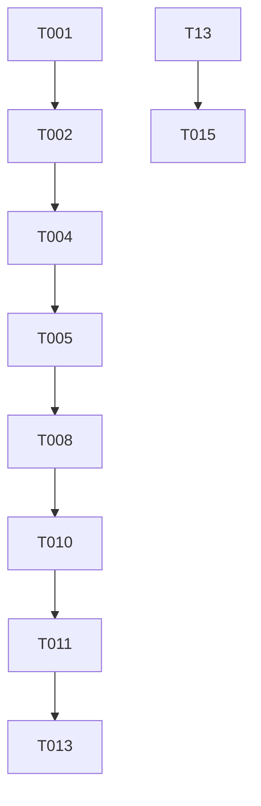

# Tasks: Phase I Todo CLI

**Branch**: `001-todo-cli-phase1` | **Feature**: 001-todo-cli-phase1

## Phase 1: Setup

Goal: Initialize the project structure and Python environment strictly according to architectural constraints.

- [X] T001 Create project structure with `src/todo/` and `tests/` directories
- [X] T002 [P] Initialize UV Python project inside `src/` with Python 3.13+
- [X] T003 [P] Configure `src/pyproject.toml` with project metadata and dependencies

## Phase 2: Foundational

Goal: Define core domain entities and base classes needed for all features.

- [X] T004 [P] Define Task domain model in `src/todo/entities.py` (Unique ID, Title, Status)
- [X] T005 [P] Implement base Task Manager in `src/todo/manager.py`
- [X] T006 [P] Create test configuration in `tests/conftest.py`

## Phase 3: User Story 1 - Manage Tasks (P1)

Goal: Implement the core CRUD logic and in-memory management of tasks.

- [X] T007 [US1] Implement unit tests for domain and manager logic in `tests/unit/`
- [X] T008 [P] [US1] Implement Add/View/Update/Delete operations in `src/todo/manager.py`
- [X] T009 [P] [US1] Implement menu-driven CLI interface in `src/todo/cli.py`

## Phase 4: User Story 2 - Local Persistence (P1)

Goal: Ensure tasks are saved/loaded from disk and accessible via the CLI.

- [X] T010 [US2] Implement JSON serialization and disk storage in `src/todo/persistence.py`
- [X] T011 [P] [US2] Implement automatic save/load logic in `src/todo/manager.py`
- [X] T012 [P] [US2] Create integration tests for persistence in `tests/integration/test_persistence.py`

## Phase 5: Polish & Integration

Goal: Wire components together and verify full system compliance.

- [X] T013 Implement application entry point in `src/todo/main.py`
- [X] T014 Implement `toggle_status` and final input validation
- [ ] T015 Perform validation & spec compliance check (FR-001 to FR-006)

---

## Dependency Graph

## Implementation Strategy

1. **MVP (US1)**: Start by getting the in-memory manager working with basic CLI input.
2. **Persistence (US2)**: Add JSON storage once the core logic is stable.
3. **Strict Order**: Follow the Task ID sequence to ensure prerequisites are met.
4. **Validation**: Use `pytest` to verify each unit of logic before moving to the CLI.
